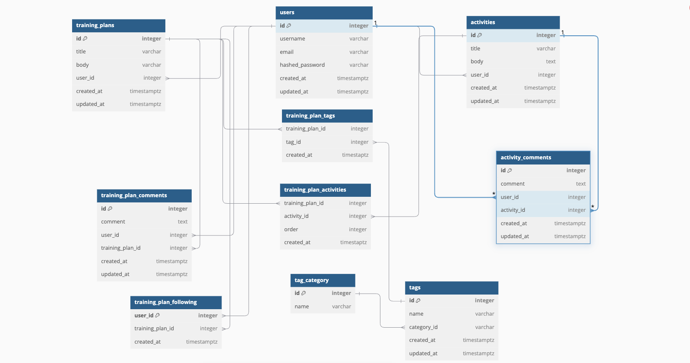

# TrackRun

## BACKEND API

## Schema


## API Documentation

## USER AUTHENTICATION/AUTHORIZATION

### All endpoints that require authentication

All endpoints that require a current user to be logged in.

* Request: endpoints that require authentication
* Error Response: Require authentication
  * Status Code: 401
  * Headers:
    * Content-Type: application/json
  * Body:

    ```json
    {
      "message": "Authentication required"
    }
    ```

### All endpoints that require proper authorization

All endpoints that require authentication and the current user does not have the
correct role(s) or permission(s).

* Request: endpoints that require proper authorization
* Error Response: Require proper authorization
  * Status Code: 403
  * Headers:
    * Content-Type: application/json
  * Body:

    ```json
    {
      "message": "Forbidden"
    }
    ```

### Get the Current User

Returns the information about the current user that is logged in.

* Require Authentication: true
* Request
  * Method: GET
  * URL: /api/users
  * Body: none

* Successful Response when there is a logged in user
  * Status Code: 200
  * Headers:
    * Content-Type: application/json
  * Body:

    ```json
    {
      "user": {
        "id": 1,
        "username": "JohnSmith",
        "email": "john.smith@gmail.com"
      }
    }
    ```

* Successful Response when there is no logged in user
  * Status Code: 200
  * Headers:
    * Content-Type: application/json
  * Body:

    ```json
    {
      "user": null
    }
    ```

### Log In a User

Logs in a current user with valid credentials and returns the current user's
information.

* Require Authentication: false
* Request
  * Method: POST
  * URL: /api/session
  * Headers:
    * Content-Type: application/json
  * Body:

    ```json
    {
      "email": "john.smith@gmail.com",
      "password": "secret password"
    }
    ```

* Successful Response
  * Status Code: 200
  * Headers:
    * Content-Type: application/json
  * Body:

    ```json
    {
      "user": {
        "id": 1,
        "username": "JohnSmith",
        "email": "john.smith@gmail.com"
      }
    }
    ```

* Error Response: Invalid credentials
  * Status Code: 401
  * Headers:
    * Content-Type: application/json
  * Body:

    ```json
    {
      "message": "Invalid credentials"
    }
    ```

* Error response: Body validation errors
  * Status Code: 400
  * Headers:
    * Content-Type: application/json
  * Body:

    ```json
    {
      "message": "Bad Request",
      "errors": {
        "email": "Email is required",
        "password": "Password is required"
      }
    }
    ```

### Sign Up a User

Creates a new user, logs them in as the current user, and returns the current
user's information.

* Require Authentication: false
* Request
  * Method: POST
  * URL: /api/users
  * Headers:
    * Content-Type: application/json
  * Body:

    ```json
    {
        "username": "JohnSmith",
        "email": "john.smith@gmail.com",
        "password": "secret password"
    }
    ```

* Successful Response
  * Status Code: 200
  * Headers:
    * Content-Type: application/json
  * Body:

    ```json
    {
      "user": {
        "id": 1,
        "username": "JohnSmith",
        "email": "john.smith@gmail.com"
      }
    }
    ```

* Error response: User already exists with the specified email
  * Status Code: 500
  * Headers:
    * Content-Type: application/json
  * Body:

    ```json
    {
      "message": "User already exists",
      "errors": {
        "email": "User with that email already exists"
      }
    }
    ```

* Error response: User already exists with the specified username
  * Status Code: 500
  * Headers:
    * Content-Type: application/json
  * Body:

    ```json
    {
      "message": "User already exists",
      "errors": {
        "username": "User with that username already exists"
      }
    }
    ```

* Error response: Body validation errors
  * Status Code: 400
  * Headers:
    * Content-Type: application/json
  * Body:

    ```json
    {
      "message": "Bad Request",
      "errors": {
        "username": "Username is required",
        "email": "Invalid email",
        "password": "Password is required"
      }
    }
    ```

### Get all Training Plans owned by the Current User

Returns all the training plans owned (created) by the current user.

* Require Authentication: true
* Request
  * Method: GET
  * URL: /api/user/training-plans
  * Body: none

* Successful Response
  * Status Code: 200
  * Headers:
    * Content-Type: application/json
  * Body:

    ```json
    {
      [
        {
          "id": 1,
          "user_id": 1,
          "activities_id": 1,
          "title": "Run a marathon in under 4 hours",
          "body": "This marathon is designed to help you run a marathon in under 4 hours.",
          "created_at": "2021-11-19 20:39:36",
          "updated_at": "2021-11-19 20:39:36"
        }
      ]
    }
    ```

### Get all Saved Training Plans of Current User
Return all the training plans saved by the current user.

* Require Authentication: true
* Request
  * Method: GET
  * URL: /api/user/training-plans/following
  * Body: none

* Successful Response
  * Status Code: 200
  * Headers:
    * Content-Type: application/json
  * Body:

    ```json
    {
       [
        {
          "id": 1,
          "user_id": 1,
          "title": "Run a marathon in under 4 hours","body": "This marathon is designed to help you run a marathon in under 4 hours.",
          "created_at": "2021-11-19 20:39:36",
          "updated_at": "2021-11-19 20:39:36" ,
        }
      ]
    }
    ```

## TRAINING PLANS

### Get all Training Plans

Return all the training plans.

* Require Authentication: false
* Request
  * Method: GET
  * URL: /api/training-plans
  * Body: none

* Successful Response
  * Status Code: 200
  * Headers:
    * Content-Type: application/json
  * Body:

    ```json
    {
        [
        {
          "id": 1,
          "user_id": 1,
          "activities_id": 1,
          "title": "Run a marathon in under 4 hours",
          "body": "This marathon is designed to help you run a marathon in under 4 hours.",
          "created_at": "2021-11-19 20:39:36",
          "updated_at": "2021-11-19 20:39:36"
        }
      ]
    }
    ```

### Get details of a Training Plan from an id

Returns the details of a training plan specified by its id.

* Require Authentication: false
* Request
  * Method: GET
  * URL: /api/training-plans/:planId
  * Body: none

* Successful Response
  * Status Code: 200
  * Headers:
    * Content-Type: application/json
  * Body:

    ```json
    {
    "id": 1,
    "title": "Run a marathon in under 4 hours",
    "body": "This marathon is designed to help you run a marathon in under 4 hours.",
    "created_at": "2021-11-19 20:39:36",
    "updated_at": "2021-11-19 20:39:36",
    "username": "MiddleAgedTodd"
    }
    ```

* Error response: Couldn't find a Training Plan with the specified id
  * Status Code: 404
  * Headers:
    * Content-Type: application/json
  * Body:

    ```json
    {
      "message": "Training Plan couldn't be found"
    }
    ```

### Get all Activities of a Training Plan
Return all activities for a training plan specified by plan id.

* Require Authentication: false
* Request
  * Method: GET
  * URL: /api/training-plans/:planId/activity
  * Body: none

* Successful Response
  * Status Code: 201
  * Headers:
    * Content-Type: application/json
  * Body:

    ```json
    {
        [
    {
      "id": 1,
      "title": "8 x 1000m repeats",
      "body": "This workout will challenge you. The goal is to run each rep at 10K pace. Slowly jog 800m in between sets"
    },
    {
      "id": 2,
      "title": "5 mile easy run",
      "body": "Run five miles at a pace 40 seconds slower than your anticapated marathon pace"
    }
  ]
    }
### Create a Training Plan

Creates and returns a new training plan.

* Require Authentication: true
* Request
  * Method: POST
  * URL: /api/training-plans
  * Headers:
    * Content-Type: application/json
  * Body:

    ```json
    {
    "title": "Run a marathon in under 4 hours",
    "body": "This marathon is designed to help you run a marathon in under 4 hours."
    }
    ```

* Successful Response
  * Status Code: 201
  * Headers:
    * Content-Type: application/json
  * Body:

    ```json
    {
      "id": 1,
      "user_id": 1,
      "title": "Run a marathon in under 4 hours",
      "body": "This marathon is designed to help you run a marathon in under 4 hours.",
      "created_at": "2021-11-19 20:39:36",
      "updated_at": "2021-11-19 20:39:36",
    }
    ```

* Error Response: Body validation error
  * Status Code: 400
  * Headers:
    * Content-Type: application/json
  * Body:

    ```json
    {
      "message": "Bad Request",
      "errors": {
        "body": "Body is required",
        "title": "Title is required"
      }
    }
    ```

### Add an Activity to a Training Plan based on the Plan's id

Create and return a new activity for a training plan specified by id.

* Require Authentication: true
* Require proper authorization: Training Plan must belong to the current user
* Request
  * Method: POST
  * URL: /api/training-plans/:planId/activities
  * Headers:
    * Content-Type: application/json
  * Body:

    ```json
    {
      "title": "8 x 1000m repeats",
      "body": "This workout will challenge you. The goal is to run each rep at 10K pace. Slowly jog 800m in between sets"
    }
    ```

* Successful Response
  * Status Code: 200
  * Headers:
    * Content-Type: application/json
  * Body:

    ```json
    {
      "id": 1,
      "title": "8 x 1000m repeats",
      "body": "This workout will challenge you. The goal is to run each rep at 10K pace. Slowly jog 800m in between sets"
    }
    ```

* Error response: Couldn't find a Training Plan with the specified id
  * Status Code: 404
  * Headers:
    * Content-Type: application/json
  * Body:

    ```json
    {
      "message": "Training Plan couldn't be found"
    }
    ```

### Edit a Training Plan

Updates and returns an existing training plan.

* Require Authentication: true
* Require proper authorization: Training must belong to the current user
* Request
  * Method: PUT
  * URL: /api/training-plans/:planId
  * Headers:
    * Content-Type: application/json
  * Body:

    ```json
    {
      "title": "Run a marathon in under 4 hours",
      "body": "This marathon is designed to help you run a marathon in under 4 hours."
    }
    ```

* Successful Response
  * Status Code: 200
  * Headers:
    * Content-Type: application/json
  * Body:

    ```json
    {
      "id": 1,
      "user_id": 1,
      "title": "Run a marathon in under 4 hours",
      "body": "This marathon is designed to help you run a marathon in under 4 hours.",
      "created_at": "2021-11-19 20:39:36",
      "updated_at": "2021-11-19 20:39:36",
    }
    ```

* Error Response: Body validation error
  * Status Code: 400
  * Headers:
    * Content-Type: application/json
  * Body:

    ```json
    {
      "message": "Bad Request",
      "errors": {
        "title": "Title is required",
        "body": "Body is required"
      }
    }
    ```

* Error response: Couldn't find a Training Plan with the specified id
  * Status Code: 404
  * Headers:
    * Content-Type: application/json
  * Body:

    ```json
    {
      "message": "Training Plan couldn't be found"
    }
    ```

### Delete a Training Plan

Deletes an existing training plan.

* Require Authentication: true
* Require proper authorization: Training plan must belong to the current user
* Request
  * Method: DELETE
  * URL: /api/training-plans/:planId
  * Body: none

* Successful Response
  * Status Code: 200
  * Headers:
    * Content-Type: application/json
  * Body:

    ```json
    {
      "message": "Successfully deleted"
    }
    ```

* Error response: Couldn't find a Training Plan with the specified id
  * Status Code: 404
  * Headers:
    * Content-Type: application/json
  * Body:

    ```json
    {
      "message": "Training Plan couldn't be found"
    }
    ```

### Get all Training Plan Comments of a Training Plan
Return all training plan comments for a training plan specified by plan id.

* Require Authentication: false
* Request
  * Method: GET
  * URL: /api/training-plans/:planId/comments
  * Body: none

* Successful Response
  * Status Code: 201
  * Headers:
    * Content-Type: application/json
  * Body:

    ```json
    {
        [
        {
          "User": {
            "email": "demo@aa.io",
            "id": 1,
            "username": "Demo"
          },
          "comment": "This plan is intense!",
          "id": 1,
          "training_plan_id": 2,
          "user_id": 1,
          "created_at": "2021-11-19 20:39:36",
          "updated_at": "2021-11-19 20:39:36"
        },
      ]
    }
    ```
### Create an Training Plan Comment
Create and return a new comment for a training plan specified by plan id.

* Require Authentication: true
* Request
  * Method: POST
  * URL: /api/training-plans/:planId/comments
  * Headers:
    * Content-Type: application/json
  * Body:

    ```json
    {
      "comment": "This plan is intense!",
    }
    ```

* Successful Response
  * Status Code: 201
  * Headers:
    * Content-Type: application/json
  * Body:

    ```json
    {
      "id": 1,
      "user_id": 1,
      "training_plan_id": 1,
      "comment": "This plan is intense!",
      "created_at": "2021-11-19 20:39:36",
      "updated_at": "2021-11-19 20:39:36"
    }
    ```

* Error Response: Body validation errors
  * Status Code: 400
  * Headers:
    * Content-Type: application/json
  * Body:

    ```json
    {
      "message": "Bad Request",
      "errors": {
        "comment": "Comment text is required",
      }
    }
    ```

### Get all Tags of a Training Plan
Returns all the tags of a specific training plan based on its id.

* Require Authentication: false
* Request
  * Method: GET
  * URL: /api/training-plans/:planId/tags
  * Body: none

* Successful Response
  * Status Code: 200
  * Headers:
    * Content-Type: application/json
  * Body:

    ```json
    {
      [
        {
          "id": 2,
          "name": "5K"
        },
        {
          "id": 3,
          "name": "Beginner"
        }
      ]
    }
    ```
* Error response: Couldn't find a Training Plan with the specified id
  * Status Code: 404
  * Headers:
    * Content-Type: application/json
  * Body:

    ```json
    {
      "error": "Training Plan not found"
    }
    ```

### Add a Tag For a Training Plan
Create if not exist and return all tags for a given training plan with the specified id.

* Require Authentication: true
* Require proper authorization: Training Plan must belong to the logged in user
* Request
  * Method: POST
  * URL: /api/training-plans/:planId/tags/:tagId
  * Headers:
    * Content-Type: application/json
  * Body:

    ```json
    {
      "name": "Marathon"
    }
    ```

* Successful Response
  * Status Code: 200
  * Headers:
    * Content-Type: application/json
  * Body:

    ```json
    {
      "id": 2,
      "name": "Marathon"
    }
    ```

* Error response: Body validation errors
  * Status Code: 400
  * Headers:
    * Content-Type: application/json
  * Body:

    ```json
    {
      {
        "name": [
          "Tag name must be less than 20 characters",
          // and/or
          "Tag name must not have space",
          // and/or
          "This field is required"
        ]
      }
    }
    ```

* Error response: Couldn't find a Training Plan with the specified id
  * Status Code: 404
  * Headers:
    * Content-Type: application/json
  * Body:

    ```json
    {
      "error": "Training Plan not found"
    }
    ```

### Delete a Tag from a Training Plan
Remove a tag from a training plan's tags.

* Require Authentication: true
* Require proper authorization: Question must belong to the logged in user
* Request
  * Method: DELETE
  * URL: /api/training-plans/:planId/tags/:tagId
  * Body: none

* Successful Response
  * Status Code: 200
  * Headers:
    * Content-Type: application/json
  * Body:

    ```json
    {
      "message": "Successfully Removed"
    }
    ```

* Error response: Couldn't find a Question with the specified id
  * Status Code: 404
  * Headers:
    * Content-Type: application/json
  * Body:

    ```json
    {
      "message": "Plan couldn't be found"
    }
    ```

* Error response: Couldn't find the specified Tag under the Question
  * Status Code: 404
  * Headers:
    * Content-Type: application/json
  * Body:

    ```json
    {
      "message": "Tag couldn't be found"
    }
    ```

### Get all training plans of a specific tag
Get all questions associated to a specific tag

* Require Authentication: false
* Request
  * Method: GET
  * URL: /api/training-plans/tags/:tagId
  * Body: none

* Successful Response
  * Status Code: 200
  * Headers:
    * Content-Type: application/json
  * Body:

    ```json
    {
      "name": "Half Marathon",
       [
        {
          "id": 1,
          "title": "Run a half marathon in under 2 hours",
          "body": "This half marathon is designed to help you run a marathon in under 2 hours.",
        }
      ]
    }
    ```

### Save a Training Plan for Later
Save a training plan for later specified by id.

* Require Authentication: true
* Request
  * Method: POST
  * URL: /api/training-plans/:planId/follow
  * Headers:
    * Content-Type: application/json

* Successful Response
  * Status Code: 201
  * Headers:
    * Content-Type: application/json
  * Body:

    ```json
    {
      "message": "Saved for later"
    }
    ```

* Error response: Couldn't find a training plan with the specified id
  * Status Code: 404
  * Headers:
    * Content-Type: application/json
  * Body:

    ```json
    {
      "message": "Training Plan couldn't be found"
    }
    ```

* Error response: The current user has already saved this training plan
  * Status Code: 500
  * Headers:
    * Content-Type: application/json
  * Body:

    ```json
    {
      "message": "This plan has already been saved"
    }
    ```

### Unsave a Training Plan
Unsaves a training plan.

* Require Authentication: true
* Require proper authorization: Training Plan must be saved by the current user
* Request
  * Method: DELETE
  * URL: /api/training-plans/:planId/follow
  * Body: none

* Successful Response
  * Status Code: 200
  * Headers:
    * Content-Type: application/json
  * Body:

    ```json
    {
      "message": "Training Plan unsaved"
    }
    ```

* Error response: Couldn't find a saved training plan with the specified id
  * Status Code: 404
  * Headers:
    * Content-Type: application/json
  * Body:

    ```json
    {
      "message": "Training Plan couldn't be found in your saved list"
    }
    ```

### Like a Training Plan
Like a training plan specified by id.

* Require Authentication: true
* Request
  * Method: POST
  * URL: /api/training-plans/:planId/like
  * Headers:
    * Content-Type: application/json

* Successful Response
  * Status Code: 201
  * Headers:
    * Content-Type: application/json
  * Body:

    ```json
    {
      "message": "You liked this training plan"
    }
    ```

* Error response: Couldn't find a training plan with the specified id
  * Status Code: 404
  * Headers:
    * Content-Type: application/json
  * Body:

    ```json
    {
      "message": "Training Plan couldn't be found"
    }
    ```

* Error response: The current user has already saved this training plan
  * Status Code: 500
  * Headers:
    * Content-Type: application/json
  * Body:

    ```json
    {
      "message": "You've already liked this training plan"
    }
    ```

### Unlike a Training Plan
Unlikes a training plan.

* Require Authentication: true
* Require proper authorization: Training Plan must be saved by the current user
* Request
  * Method: DELETE
  * URL: /api/training-plans/:planId/like
  * Body: none

* Successful Response
  * Status Code: 200
  * Headers:
    * Content-Type: application/json
  * Body:

    ```json
    {
      "message": "Training Plan unliked"
    }
    ```

* Error response: Couldn't find a liked training plan with the specified id
  * Status Code: 404
  * Headers:
    * Content-Type: application/json
  * Body:

    ```json
    {
      "message": "Training Plan couldn't be found in your liked list"
    }
    ```

### Delete a Training Plan Comment
Delete an existing Training Plan Comment.

* Require Authentication: true
* Request
  * Method: DELETE
  * URL: /api/training-plans/comments/:commentId
  * Body: none

* Successful Response
  * Status Code: 200
  * Headers:
    * Content-Type: application/json
  * Body:

    ```json
    {
      "message": "Successfully deleted"
    }
    ```

* Error response: Couldn't find a Training Plan Comment with the specified id
  * Status Code: 404
  * Headers:
    * Content-Type: application/json
  * Body:

    ```json
    {
      "message": "Comment couldn't be found"
    }
    ```

## Training Plan Comments

### Edit a Training Plan Comment
Update and return an existing training plan comment.

* Require Authentication: true
* Request
  * Method: PUT
  * URL: /api/training-plan-comments/:commentId
  * Headers:
    * Content-Type: application/json
  * Body:

    ```json
    {
      "comment": "This plan is great!",
    }
    ```

* Successful Response
  * Status Code: 201
  * Headers:
    * Content-Type: application/json
  * Body:

    ```json
    {
      "id": 1,
      "user_id": 1,
      "training_plan_id": 1,
      "comment": "This plan is great!",
      "created_at": "2021-11-19 20:39:36",
      "updated_at": "2021-11-19 20:39:36"
    }
    ```

* Error Response: Body validation errors
  * Status Code: 400
  * Headers:
    * Content-Type: application/json
  * Body:
    ```json
    {
      "message": "Bad Request",
      "errors": {
        "comment": "Comment text is required",
      }
    }
    ```

* Error response: Couldn't find a Training Plan Comment with the specified id
  * Status Code: 404
  * Headers:
    * Content-Type: application/json
  * Body:

    ```json
    {
      "message": "Comment couldn't be found"
    }

## Activities

### Edit an Activity

Update and return an existing activity.

* Require Authentication: true
* Require proper authorization: Activity must belong to the current user
* Request
  * Method: PUT
  * URL: /api/activity/:activityId
  * Headers:
    * Content-Type: application/json
  * Body:

    ```json
    {
      "title": "8 x 1000m repeats",
      "body": "This workout will challenge you. The goal is to run each rep at 10K pace. Slowly jog 800m in between sets"
    }
    ```

* Successful Response
  * Status Code: 200
  * Headers:
    * Content-Type: application/json
  * Body:

    ```json
    {
      "id": 1,
      "user_id": 1,
      "title": "Run a marathon in under 4 hours",
      "body": "This marathon is designed to help you run a marathon in under 4 hours.",
      "created_at": "2021-11-19 20:39:36",
      "updated_at": "2021-11-19 20:39:36",
    }
    ```

### Delete an Activity

Delete an existing activity for a Training Plan.

* Require Authentication: true
* Require proper authorization: Training Plan must belong to the current user
* Request
  * Method: DELETE
  * URL: /api/activity/:activityId
  * Body: none

* Successful Response
  * Status Code: 200
  * Headers:
    * Content-Type: application/json
  * Body:

    ```json
    {
      "message": "Successfully deleted"
    }
    ```

* Error response: Couldn't find an activity with the specified id
  * Status Code: 404
  * Headers:
    * Content-Type: application/json
  * Body:

    ```json
    {
      "message": "Activity couldn't be found"
    }
    ```
### Get all Activity Comments of an Activity
Create and return a new activity comment for a activity specified by activity id.

* Require Authentication: false
* Request
  * Method: GET
  * URL: /api/activity/:activityId/comments
  * Body: none

* Successful Response
  * Status Code: 201
  * Headers:
    * Content-Type: application/json
  * Body:

    ```json
    {
    "ActivityComments": [
        {
          "User": {
            "email": "demo@aa.io",
            "id": 1,
            "username": "Demo"
          },
          "comment": "Are you hydrating well?",
          "id": 1,
          "activity_id": 2,
          "user_id": 1
        },
      ]
    }
    ```
### Create an Activity Comment
Create and return a new activity comment for an activity specified by activity id.

* Require Authentication: true
* Request
  * Method: POST
  * URL: /api/activity/:activityId/comments
  * Headers:
    * Content-Type: application/json
  * Body:

    ```json
    {
      "comment": "Are you hydrating well?",
    }
    ```

* Successful Response
  * Status Code: 201
  * Headers:
    * Content-Type: application/json
  * Body:

    ```json
    {
      "id": 1,
      "user_id": 1,
      "activity_id": 1,
      "comment": "Are you hydrating well?"
    }
    ```

* Error Response: Body validation errors
  * Status Code: 400
  * Headers:
    * Content-Type: application/json
  * Body:

    ```json
    {
      "message": "Bad Request",
      "errors": {
        "comment": "Comment text is required",
      }
    }
    ```

## Activity Comments

### Edit a Activity Comment
Update and return an existing activity comment.

* Require Authentication: true
* Request
  * Method: PUT
  * URL: /api/activity-comments/:commentId
  * Headers:
    * Content-Type: application/json
  * Body:

    ```json
    {
      "comment": "I don't know my 5K pace, what's the best way to find out, aside from running an all out 5K?",
    }
    ```

* Successful Response
  * Status Code: 201
  * Headers:
    * Content-Type: application/json
  * Body:

    ```json
    {
      "id": 1,
      "user_id": 1,
      "activity_id": 1,
      "comment": "I don't know my 5K pace, what's the best way to find out, aside from running an all out 5K?",
      "created_at": "2021-11-19 20:39:36",
      "updated_at": "2021-11-19 20:39:36"
    }
    ```

* Error Response: Body validation errors
  * Status Code: 400
  * Headers:
    * Content-Type: application/json
  * Body:
    ```json
    {
      "message": "Bad Request",
      "errors": {
        "comment": "Comment text is required",
      }
    }
    ```

* Error response: Couldn't find a Activity Comment with the specified id
  * Status Code: 404
  * Headers:
    * Content-Type: application/json
  * Body:

    ```json
    {
      "message": "Comment couldn't be found"
    }


### Delete a Activity Comment
Delete an existing Activity Comment.

* Require Authentication: true
* Request
  * Method: DELETE
  * URL: /api/activity/comments/:commentId
  * Body: none

* Successful Response
  * Status Code: 200
  * Headers:
    * Content-Type: application/json
  * Body:

    ```json
    {
      "message": "Successfully deleted"
    }
    ```

* Error response: Couldn't find a Activity Comment with the specified id
  * Status Code: 404
  * Headers:
    * Content-Type: application/json
  * Body:

    ```json
    {
      "message": "Comment couldn't be found"
    }
    ```


## Tags

### Get all Tags
Returns all the tags.

* Require Authentication: false
* Request
  * Method: GET
  * URL: /api/tags
  * Body: none

* Successful Response
  * Status Code: 200
  * Headers:
    * Content-Type: application/json
  * Body:

    ```json
    {
       [
        {
          "id": 1,
          "name": "5K",
          "numPlans": 1
        },
        {
          "id": 2,
          "name": "Marathon",
          "numPlans": 2
        },
        {
          "id": 3,
          "name": "10K",
          "numPlans": 1
        }
      ]
    }
    ```
